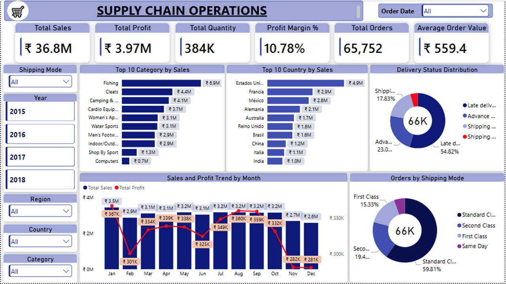
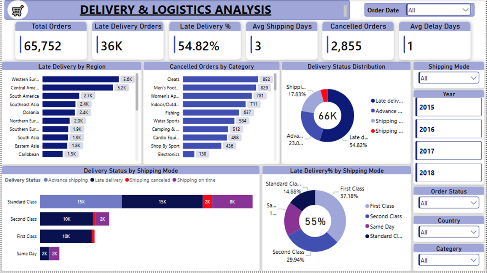
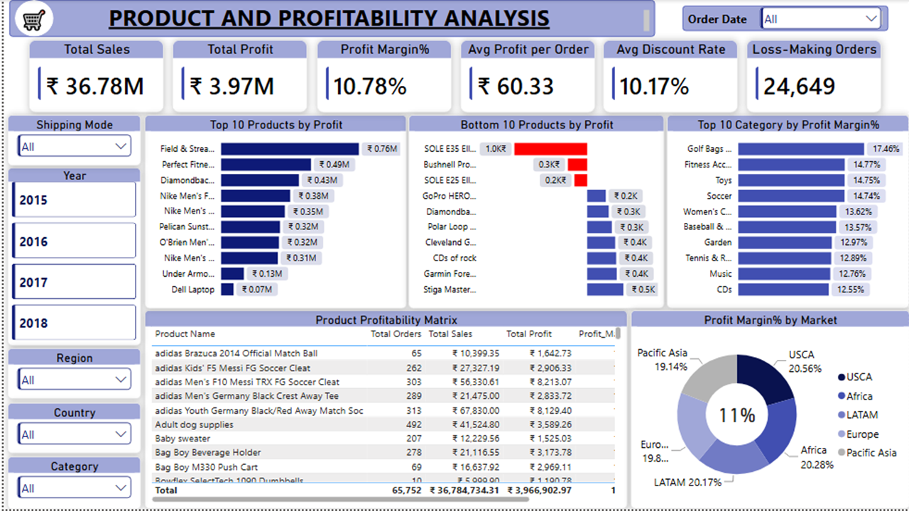

# Supply Chain Analytics — Power BI

## Project Overview

An end-to-end supply chain analytics project built using **Microsoft Power BI, DAX, Power Query, and data modeling**.

The project analyzes supply chain performance across three business perspectives:

- **Supply Chain Operations**
- **Delivery & Logistics**
- **Product & Profitability**

The objective is to identify operational bottlenecks, delivery issues, product profitability patterns, and market-level performance.

---

## Business Questions

This project focuses on answering:

1. How is the overall supply chain performing?
2. Where are delivery delays and cancellations concentrated?
3. Which products, categories, and markets are driving profitability?
4. How do shipping modes affect delivery performance?
5. Which products and orders are contributing to losses?

---

## Tools & Technologies

- **Power BI**
- **DAX**
- **Power Query**
- **Data Modeling**
- **Microsoft Excel**

---

## Dataset

**Dataset:** DataCo Smart Supply Chain

The dataset contains approximately **180K+ order-item records** covering supply chain, customer, product, sales, shipping, and delivery information.

> The raw dataset is not included in this repository because of file-size limitations.

---

# Dashboard Pages

## 1. Supply Chain Operations

Provides an executive-level overview of sales, profitability, orders, product/category performance, country performance, delivery status, and shipping modes.

### Key KPIs

- Total Sales: **₹36.78M**
- Total Profit: **₹3.97M**
- Profit Margin: **10.78%**
- Total Orders: **65,752**
- Total Quantity: **384K**
- Average Order Value: **₹559.4**

### Dashboard Preview



---

## 2. Delivery & Logistics Analysis

Focuses on delivery performance, late shipments, cancellations, shipping modes, regions, and order fulfillment.

### Key KPIs

- Total Orders: **65,752**
- Late Delivery Orders: **36K**
- Late Delivery Rate: **54.82%**
- Average Shipping Days: **3**
- Cancelled Orders: **2,855**
- Average Shipping Delay: **1 day**

### Dashboard Preview



---

## 3. Product & Profitability Analysis

Analyzes product-level profitability, loss-making orders, category margins, discount rates, and market profitability.

### Key KPIs

- Total Sales: **₹36.78M**
- Total Profit: **₹3.97M**
- Profit Margin: **10.78%**
- Average Profit per Order: **₹60.33**
- Average Discount Rate per Order: **10.17%**
- Loss-Making Orders: **24,649**

### Dashboard Preview



---

# Business Insights

## Executive Overview

- The business generated **₹36.78M in sales across 65,752 orders**, producing **₹3.97M profit** at a **10.78% profit margin**.
- **Fishing** was the largest sales category at approximately **₹6.9M**, followed by Cleats and Camping & Hiking.
- The **United States** was the leading country by sales at approximately **₹4.9M**.
- **54.82% of orders were classified as late deliveries**, making delivery reliability the clearest operational concern.
- **Standard Class accounted for 59.81% of orders**, making it the dominant shipping mode.

## Delivery & Logistics

- Approximately **36K orders were late**, representing **54.82% of total orders**.
- **Western Europe** recorded the highest volume of late deliveries at approximately **5.6K**.
- **Cleats** had the highest number of cancelled orders at **852**.
- **First Class** showed the highest late-delivery rate among the displayed shipping modes at **37.18%**.
- Average shipping time was approximately **3 days**, with an average shipping delay of **1 day**.

## Product & Profitability

- **Field & Stream** was the leading product contributor by profit at approximately **₹0.76M**.
- Several products generated negative profit, including products appearing in the Bottom 10 profitability analysis.
- **Golf Bags** had the highest displayed category profit margin at **17.46%**.
- Average discount rate per order was **10.17%**.
- **USCA** showed the highest displayed market profit margin at **20.56%**.
- The analysis identified **24,649 loss-making orders**.

---

# Project Structure

```text
Supply-Chain-Analytics-PowerBI
│
├── Screenshots/
│   ├── supply-chain-executive-overview.png
│   ├── delivery-logistics-analysis.png
│   └── product-profitability-analysis.png
│
├── Supply_Chain_Report.pbix
└── Supply Chain Project Insights Document.docx
